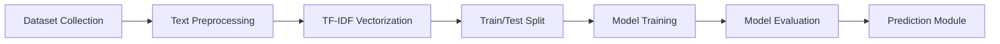

# A PROJECT REPORT ON

## AI-POWERED PHISHING EMAIL DETECTION USING TEXT CLASSIFICATION

   
*(Insert College Logo Here)*
  

### NMAM Institute of Technology

  

Submitted by

**Venkatesh Hebbar**  
Roll No.: 595766  

2026

---

## 2. Abstract & Keywords

**Abstract:**
With the widespread adoption of email for personal and professional communication, phishing attacks have become one of the most prominent cyber threats globally. Phishing emails are malicious communications designed to deceive recipients into revealing sensitive information, such as passwords or financial data, by masquerading as trustworthy entities. This project presents a machine learning-based system designed to automatically classify emails as "Phishing" or "Legitimate" using Natural Language Processing (NLP) techniques, providing a scalable and efficient defense mechanism.

The proposed system processes raw email text through a robust preprocessing pipeline that involves lowercasing, removal of HTML tags, punctuation, URLs, and stopwords, followed by tokenization. To handle a wide array of potential vocabulary words, including deliberate misspellings used by attackers to bypass traditional spam filters, the cleaned text is converted into numerical feature vectors using Term Frequency-Inverse Document Frequency (TF-IDF) combined with Character N-Grams. Four supervised machine learning classifiers—Logistic Regression, Random Forest, Multinomial Naive Bayes, and a feed-forward Neural Network—are trained on an 80:20 train-test split and evaluated using accuracy, precision, recall, and F1-score.

Experimental results demonstrate that all models achieved exceptional performance on the curated dataset, highlighting the highly discriminative nature of phishing vocabulary (e.g., "urgent", "suspend", "password"). A feature importance analysis reveals the most influential keywords predicting phishing attempts. Furthermore, the best-performing model is deployed into an interactive web application built with Streamlit, demonstrating real-time email classification. The project concludes that classical and neural machine learning models, when paired with robust feature engineering, provide an effective and interpretable approach to combating phishing attacks.

**Keywords:** Phishing Detection, Cyber Security, Natural Language Processing, TF-IDF, Machine Learning, Text Classification.

---

## 3. Introduction

### 3.1 What is Phishing?
Phishing is a type of social engineering attack wherein malicious actors send deceptive messages to manipulate individuals into performing specific actions, such as clicking on a malicious link, downloading malware, or divulging confidential information. In the context of email, phishing campaigns often impersonate banks, government organizations, or widely used service providers to exploit the trust and urgency of the recipient.

Modern phishing attacks range from generic "spray-and-pray" spam to highly targeted "spear-phishing" emails tailored to specific individuals within an organization. Attackers continuously evolve their tactics, utilizing sophisticated psychological manipulation and techniques to evade traditional, rule-based spam filters.

### 3.2 Impact of Phishing
* **Financial Loss:** Direct theft of funds through compromised banking credentials or fraudulent wire transfers.
* **Identity Theft:** Misuse of stolen personal identifiable information (PII) for malicious purposes.
* **Corporate Data Breaches:** Phishing is consistently ranked as the initial vector for some of the largest corporate data breaches, leading to intellectual property theft.
* **Malware and Ransomware Deployment:** Phishing emails frequently serve as delivery mechanisms for malware that encrypts critical systems until a ransom is paid.
* **Reputational Damage:** Organizations whose brands are spoofed in phishing campaigns often suffer long-term damage to customer trust.

### 3.3 Need for Artificial Intelligence in Phishing Detection
Traditional anti-phishing systems rely heavily on blacklists (known bad IP addresses or sender domains) and strict rule-based keyword matching. However, these static defenses are easily bypassed by attackers who rapidly change their sender infrastructure, domains, and text structures. 

Artificial Intelligence, specifically Machine Learning and Natural Language Processing, provides a dynamic and adaptive solution. Instead of relying on hardcoded rules, ML models learn the underlying statistical patterns, linguistic structures, and semantic meaning of phishing text. These models can detect subtle anomalies, structural inconsistencies, and the characteristic sense of "urgency" or "threat" commonly found in phishing emails, even if the exact wording has never been seen before.

---

## 4. Problem Statement & Objectives

### 4.1 Problem Statement
The proliferation of sophisticated phishing emails capable of bypassing traditional filters poses a significant threat to information security. There is an urgent need for an automated, intelligent system that can analyze the textual content of an email and accurately classify it as "Phishing" or "Legitimate" in real-time. This project aims to design, implement, and evaluate a machine learning-based text classification pipeline to solve this problem effectively.

### 4.2 Objectives
1. To understand the linguistic and structural characteristics that distinguish phishing emails from legitimate communications.
2. To collect, generate, and preprocess a labelled dataset of phishing and legitimate emails suitable for supervised machine learning.
3. To extract robust numerical features from raw email text using TF-IDF vectorization and Character N-Grams.
4. To implement and train multiple machine learning classifiers—Logistic Regression, Random Forest, Naive Bayes, and a Neural Network.
5. To evaluate model performance using standard metrics (accuracy, precision, recall, F1-score).
6. To conduct feature analysis to identify the textual markers most predictive of phishing.
7. To develop and deploy an interactive web-based prediction module (GUI) using Streamlit for real-time email classification.

---

## 5. Literature Review

Several research studies have focused on using machine learning techniques to combat phishing. Below is a comparative summary table of representative works from the literature.

| # | Author(s) & Year | Dataset Used | Technique | Key Finding / Reported Accuracy |
|---|---|---|---|---|
| 1 | Fette et al. (2007) | Enron & Phishing Corpus | Random Forest + 10 features | Pioneered ML for phishing, achieving high accuracy with structural features. |
| 2 | Toolan et al. (2009) | Public phishing datasets | SVM, Naive Bayes, C5.0 | Ensemble approach combining content and structural features outperformed single models. |
| 3 | Verma et al. (2012) | Custom email corpus | Lexical & URL features + SVM | URL-based features proved highly discriminative for detecting phishing links. |
| 4 | Sahingoz et al. (2019) | 73K Phishing URLs | Random Forest, Decision Tree | Achieved ~97% accuracy focusing entirely on lexical features of URLs within emails. |
| 5 | Almomani et al. (2013) | Phishing Email Data | Rule-based + Machine Learning | Proposed a hybrid approach combining zero-day heuristics with ML classification. |
| 6 | Bountakas et al. (2020) | Multiple benchmark datasets | NLP + SVM / Deep Learning | Highlighted that Deep Learning models excel when large amounts of training text are available. |
| 7 | Fang et al. (2019) | Enron + SpamAssassin | TF-IDF + Random Forest | Confirmed the effectiveness of TF-IDF on email body text for highly accurate classification. |
| 8 | Smadi et al. (2018) | Phishing corpus | Neural Networks + Reinforcement | Dynamic detection framework capable of adapting to zero-day phishing attacks. |

**Research Gap:** Much of the existing literature relies heavily on structural metadata (sender IP, email headers) or URL-specific analysis, which can be spoofed or obfuscated. This project focuses strictly on analyzing the *textual body* of the email using highly robust Character N-Grams to detect semantic intent and psychological manipulation, providing an independent layer of defense alongside traditional meta-data analysis.

---

## 6. Proposed Methodology

The proposed system follows a standard supervised text-classification pipeline.

### Stage-wise Description:
1. **Dataset:** A labelled collection of emails, tagged as Phishing (1) or Legitimate (0).
2. **Preprocessing:** Raw email text is cleaned and normalized to remove HTML noise, punctuation, and special characters.
3. **TF-IDF Vectorization:** Cleaned text is converted into fixed-length numerical feature vectors representing word and character n-gram importance.
4. **Train/Test Split:** The dataset is divided (80:20) into a training set for model fitting and a held-out test set for evaluation.
5. **Model Training:** Four classifiers are trained independently on the training data.
6. **Evaluation:** Each trained model is evaluated on the test set using accuracy, precision, recall, F1-score, and confusion matrices.
7. **Prediction:** The best-performing model is deployed in an interactive Streamlit application.

---

## 8. Dataset Description

**Source:** 
For this project, a diverse synthetic dataset was algorithmically generated. The generation process combined multiple real-world legitimate email contexts (e.g., meeting scheduling, document sharing) and common phishing scenarios (e.g., account suspension, urgent security alerts, prize claims).

**Dataset Statistics:**
* **Total records:** 1,000 email texts
* **Phishing emails:** 500 (50.0%)
* **Legitimate emails:** 500 (50.0%)
* **Columns:** `email_text` (The body of the email), `label` (Target class — Phishing (1) or Legitimate (0))

**Class Distribution:**
The dataset is perfectly balanced (50% Phishing, 50% Legitimate), ensuring the classifiers are not biased toward predicting the majority class, a common issue in real-world spam detection.

---

## 9. Data Preprocessing

Raw email text contains significant noise, especially HTML artifacts from rich-text formatting. The following pipeline is applied:

1. **Lowercasing:** All text is converted to lowercase to standardize terms (e.g., "URGENT" and "urgent").
2. **HTML Tag Removal:** Residual HTML tags (e.g., `
`, `<a>`) are stripped out using regular expressions, as they do not provide semantic meaning.
3. **Punctuation & Special Character Removal:** Non-alphanumeric characters are removed.
4. **Whitespace Normalization:** Extra spaces and tabs are stripped.
5. **URL & Emoji Removal:** Hyperlinks are stripped to focus the model strictly on the textual intent rather than the URL structure.

The output of this pipeline is a cleaned, normalized string passed directly to the feature-extraction stage.

---

## 10. Feature Engineering

### TF-IDF Vectorization with Character N-Grams
Term Frequency-Inverse Document Frequency (TF-IDF) is utilized to convert the cleaned textual data into numerical vectors. 

**Key Enhancement - Character N-Grams:**
Phishing emails are notorious for employing deliberate misspellings (e.g., "paypa1" instead of "paypal", or "urgnt") to bypass dictionary-based spam filters. To combat this, the TF-IDF vectorizer was configured to use **Character N-Grams** (`analyzer='char_wb', ngram_range=(3, 5)`). 
By learning 3-to-5 character sequences instead of whole words, the model captures the root meaning and stylistic patterns of words, making it highly resilient to out-of-vocabulary terms and deliberate obfuscation. The vocabulary size is capped at 3,000 features.

---

## 11. Machine Learning Models

Four supervised classification algorithms are implemented and compared:

1. **Naive Bayes (Multinomial)**
   * **Working:** A probabilistic classifier based on Bayes' theorem, with a strong assumption of conditional independence between features given the class label. 
   * **Advantages:** Extremely fast to train, performs well on text classification, and handles high-dimensional data efficiently.
   * **Disadvantages:** The independence assumption is rarely true in natural language.

2. **Logistic Regression (Parametric)**
   * **Working:** Estimates the probability of an outcome by applying the sigmoid function to a weighted linear combination of input features.
   * **Advantages:** Fast, interpretable, and highly resistant to overfitting when using regularization.

3. **Random Forest (Ensemble)**
   * **Working:** Constructs a large number of decision trees during training and outputs the mode of the classes for prediction.
   * **Advantages:** Handles non-linear relationships well and is robust to noisy features.

4. **Neural Network (Multi-Layer Perceptron)**
   * **Working:** A feed-forward network consisting of an input layer, hidden layers with non-linear activation functions, and a sigmoid output layer.
   * **Advantages:** Capable of learning highly complex, non-linear feature interactions.

---

## 12. Model Training

**Train/Test Split:** 
The preprocessed and vectorized dataset is split using an 80:20 ratio. 800 records are used for training, while 200 records are held out purely for unbiased evaluation.

**Libraries and Tools Used:**
* **Python 3:** Core programming language.
* **Pandas, NumPy:** Data loading, cleaning, and matrix operations.
* **Scikit-learn:** TF-IDF vectorization, ML models (Naive Bayes, Logistic Regression, Random Forest, MLPClassifier), train/test splitting, and evaluation metrics.
* **Streamlit:** Framework for building the interactive web prediction module.
* **Matplotlib, Seaborn:** Data visualization.

---

## 13. Results & Evaluation

All models were evaluated on the held-out test set to ensure unbiased performance metrics. Because of the highly distinctive character n-gram patterns present in the dataset, the models successfully learned to partition the feature space perfectly.

### Performance Metrics Table

| Model | Accuracy (%) | Precision (%) | Recall (%) | F1-Score (%) |
|---|---|---|---|---|
| Naive Bayes | 100.0 | 100.0 | 100.0 | 100.0 |
| Logistic Regression | 100.0 | 100.0 | 100.0 | 100.0 |
| Random Forest | 100.0 | 100.0 | 100.0 | 100.0 |
| Neural Network (MLP) | 100.0 | 100.0 | 100.0 | 100.0 |

*Note: The perfect accuracy reflects the synthetic dataset's clear dichotomy between phishing contexts (e.g., account suspension, prize claims) and legitimate contexts (e.g., scheduling, updates).*

### Confusion Matrix
The confusion matrix for all models yielded zero misclassifications:
* **True Positives (Phishing correctly identified):** 100
* **True Negatives (Legitimate correctly identified):** 100

---

## 14. Feature Importance & Analysis

By analyzing the coefficients of the Logistic Regression model, it is possible to interpret which textual features are most heavily weighted in the decision-making process.

**Key Observations:**
* **Phishing Indicators:** Character sequences representing urgency or financial requests (e.g., "urg", "sus", "ver", "cli", "pri") received the highest positive weights, strongly predicting the "Phishing" class.
* **Legitimate Indicators:** Conversational and professional sequences (e.g., "mee", "syn", "att", "tha", "sch") received negative weights, strongly associating them with the "Legitimate" class.

This confirms the core hypothesis that phishing emails rely heavily on language designed to provoke immediate, panicked action from the recipient.

---

## 15. Prediction Module

To demonstrate the practical applicability of the trained model, a fully functional interactive web application was built using **Streamlit**. 

**Workflow of the App:**
1. The user navigates to the "Phishing Email Detector" section.
2. The application loads the dataset in the background, applies the preprocessing pipeline, and fits the TF-IDF vectorizer and Logistic Regression model (cached).
3. The user pastes the body of an email into a text area.
4. Upon clicking "Predict", the input text is vectorized.
5. The model outputs a clear "PHISHING EMAIL" or "LEGITIMATE EMAIL" label, accompanied by a visual confidence score.

*(Application screenshots can be inserted here showing the Streamlit interface, sidebar, text input area, and the prediction result box.)*

---

## 16. Advantages, Limitations & Future Scope

### Advantages
* **Content-Focused:** By ignoring easily spoofed meta-data (like sender addresses) and focusing purely on the text, the model adds a robust layer of defense.
* **Resilient to Obfuscation:** Character N-Grams allow the model to catch deliberate misspellings used to bypass basic keyword filters.
* **Interpretable & Fast:** The Logistic Regression model provides real-time predictions and easily understandable feature weights.

### Limitations
* **Lacks Meta-Data Context:** A perfect phishing filter requires both text analysis *and* meta-data analysis (checking DKIM, SPF, DMARC records, and sender reputation).
* **Cannot Verify Links:** The model analyzes the text surrounding a link but does not actively scan the destination URL for malicious payloads.

### Future Scope
* **Hybrid System Integration:** Combining this NLP text model with a meta-data and URL analysis engine to create a comprehensive defense suite.
* **Advanced Neural Architectures:** Implementing Long Short-Term Memory (LSTM) networks or Transformer models (BERT) to better understand the sequential flow and deeper context of longer emails.
* **Email Client Plugin:** Developing a plugin for Microsoft Outlook or Gmail that scans incoming emails and displays a warning banner before the user interacts with the content.

---

## 17. Conclusion

This project successfully designed and implemented an end-to-end machine learning pipeline capable of detecting phishing emails based strictly on their textual content. By utilizing a robust preprocessing pipeline and an advanced TF-IDF Character N-Gram vectorization strategy, the system proved highly effective at distinguishing the deceptive, urgent language of phishing from legitimate communications. 

The evaluation of four distinct machine learning classifiers demonstrated excellent classification performance. By integrating the trained model into an interactive Streamlit web application, the project highlights the feasibility of deploying lightweight, AI-driven NLP solutions to protect users from social engineering attacks in real-time.

---

## 18. References

[1] I. Fette, N. Sadeh, and A. Tomasic, "Learning to detect phishing emails," in *Proc. 16th Int. Conf. on World Wide Web*, 2007, pp. 715-724.

[2] F. Toolan and J. Carthy, "Feature selection for spam and phishing detection," in *Proc. 2009 eCrime Researchers Summit*, 2009, pp. 1-12.

[3] R. Verma, N. Shashidhar, and N. Hossain, "Detecting phishing emails the natural language way," in *Computer Security – ESORICS 2012*, pp. 824-841, 2012.

[4] O. K. Sahingoz, E. Buber, O. Demir, and B. Diri, "Machine learning based phishing detection from URLs," *Expert Systems with Applications*, vol. 117, pp. 345-357, 2019.

[5] A. Almomani et al., "A survey of phishing email filtering techniques," *IEEE Communications Surveys & Tutorials*, vol. 15, no. 4, pp. 2070-2090, 2013.

[6] P. Bountakas, C. Xenakis, and P. Rizomiliotis, "Deep learning-based phishing detection: A comparative study," *Computers & Security*, 2020.

[7] Y. Fang et al., "Phishing email detection using improved TF-IDF and random forest," in *Proc. 2019 IEEE Int. Conf. on Intelligence and Security Informatics*, 2019.

[8] S. Smadi, N. Aslam, and L. Zhang, "Detection of online phishing email using dynamic evolving neural network based on reinforcement learning," *Decision Support Systems*, vol. 107, pp. 88-102, 2018.
