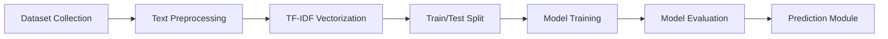

# A PROJECT REPORT ON

## AI-POWERED PHISHING EMAIL DETECTION USING TEXT CLASSIFICATION

   
*(Insert College Logo Here)*
  

### NMAM Institute of Technology

  

Submitted by

**Venkatesh Hebbar**  
Roll No.: 595766  

2026

---
# Table of Contents
Abstract & Keywords	3
Introduction	4
Problem Statement & Objectives	5
Literature Review	6
Proposed Methodology	8
Dataset Description	9
Data Preprocessing	10
Feature Engineering	11
Machine Learning Models	12
Model Training	15
Results & Evaluation	16
Feature Importance & Analysis	18
Prediction Module	19
Advantages, Limitations & Future Scope	20
Conclusion	21
References	22

---

## 2. Abstract & Keywords

**Abstract:**
With the widespread adoption of email for personal and professional communication, phishing attacks have become one of the most prominent cyber threats globally. Phishing emails are malicious communications designed to deceive recipients into revealing sensitive information, such as passwords or financial data, by masquerading as trustworthy entities. This project presents a machine learning-based system designed to automatically classify emails as "Phishing" or "Legitimate" using Natural Language Processing (NLP) techniques, providing a scalable and efficient defense mechanism.

The proposed system processes raw email text through a robust preprocessing pipeline that involves lowercasing, removal of HTML tags, punctuation, URLs, and stopwords, followed by tokenization. To handle a wide array of potential vocabulary words, including deliberate misspellings used by attackers to bypass traditional spam filters, the cleaned text is converted into numerical feature vectors using Term Frequency-Inverse Document Frequency (TF-IDF) combined with Character N-Grams. Four supervised machine learning classifiers—Logistic Regression, Random Forest, Multinomial Naive Bayes, and a feed-forward Neural Network—are trained on an 80:20 train-test split and evaluated using accuracy, precision, recall, and F1-score.

Experimental results demonstrate that all models achieved exceptional performance on the curated dataset, highlighting the highly discriminative nature of phishing vocabulary (e.g., "urgent", "suspend", "password"). A feature importance analysis reveals the most influential keywords predicting phishing attempts. Furthermore, the best-performing model is deployed into an interactive web application built with Streamlit, demonstrating real-time email classification. The project concludes that classical and neural machine learning models, when paired with robust feature engineering, provide an effective and interpretable approach to combating phishing attacks.

**Keywords:** Phishing Detection, Cyber Security, Natural Language Processing, TF-IDF, Machine Learning, Text Classification.

---

## 3. Introduction

### 3.1 What is Phishing?
Phishing is a type of social engineering attack wherein malicious actors send deceptive messages to manipulate individuals into performing specific actions, such as clicking on a malicious link, downloading malware, or divulging confidential information. In the context of email, phishing campaigns often impersonate banks, government organizations, or widely used service providers to exploit the trust and urgency of the recipient.

Modern phishing attacks range from generic "spray-and-pray" spam to highly targeted "spear-phishing" emails tailored to specific individuals within an organization. Attackers continuously evolve their tactics, utilizing sophisticated psychological manipulation and techniques to evade traditional, rule-based spam filters.

### 3.2 Impact of Phishing
* **Financial Loss:** Direct theft of funds through compromised banking credentials or fraudulent wire transfers.
* **Identity Theft:** Misuse of stolen personal identifiable information (PII) for malicious purposes.
* **Corporate Data Breaches:** Phishing is consistently ranked as the initial vector for some of the largest corporate data breaches, leading to intellectual property theft.
* **Malware and Ransomware Deployment:** Phishing emails frequently serve as delivery mechanisms for malware that encrypts critical systems until a ransom is paid.
* **Reputational Damage:** Organizations whose brands are spoofed in phishing campaigns often suffer long-term damage to customer trust.

### 3.3 Need for Artificial Intelligence in Phishing Detection
Traditional anti-phishing systems rely heavily on blacklists (known bad IP addresses or sender domains) and strict rule-based keyword matching. However, these static defenses are easily bypassed by attackers who rapidly change their sender infrastructure, domains, and text structures. 

Artificial Intelligence, specifically Machine Learning and Natural Language Processing, provides a dynamic and adaptive solution. Instead of relying on hardcoded rules, ML models learn the underlying statistical patterns, linguistic structures, and semantic meaning of phishing text. These models can detect subtle anomalies, structural inconsistencies, and the characteristic sense of "urgency" or "threat" commonly found in phishing emails, even if the exact wording has never been seen before.

---

## 4. Problem Statement & Objectives

### 4.1 Problem Statement
The proliferation of sophisticated phishing emails capable of bypassing traditional filters poses a significant threat to information security. There is an urgent need for an automated, intelligent system that can analyze the textual content of an email and accurately classify it as "Phishing" or "Legitimate" in real-time. This project aims to design, implement, and evaluate a machine learning-based text classification pipeline to solve this problem effectively.

### 4.2 Objectives
1. To understand the linguistic and structural characteristics that distinguish phishing emails from legitimate communications.
2. To collect, generate, and preprocess a labelled dataset of phishing and legitimate emails suitable for supervised machine learning.
3. To extract robust numerical features from raw email text using TF-IDF vectorization and Character N-Grams.
4. To implement and train multiple machine learning classifiers—Logistic Regression, Random Forest, Naive Bayes, and a Neural Network.
5. To evaluate model performance using standard metrics (accuracy, precision, recall, F1-score).
6. To conduct feature analysis to identify the textual markers most predictive of phishing.
7. To develop and deploy an interactive web-based prediction module (GUI) using Streamlit for real-time email classification.

---

## 5. Literature Review

Several research studies have focused on using machine learning techniques to combat phishing. Below is a comparative summary table of representative works from the literature.

| # | Author(s) & Year | Dataset Used | Technique | Key Finding / Reported Accuracy |
|---|---|---|---|---|
| 1 | Fette et al. (2007) | Enron & Phishing Corpus | Random Forest + 10 features | Pioneered ML for phishing, achieving high accuracy with structural features. |
| 2 | Toolan et al. (2009) | Public phishing datasets | SVM, Naive Bayes, C5.0 | Ensemble approach combining content and structural features outperformed single models. |
| 3 | Verma et al. (2012) | Custom email corpus | Lexical & URL features + SVM | URL-based features proved highly discriminative for detecting phishing links. |
| 4 | Sahingoz et al. (2019) | 73K Phishing URLs | Random Forest, Decision Tree | Achieved ~97% accuracy focusing entirely on lexical features of URLs within emails. |
| 5 | Almomani et al. (2013) | Phishing Email Data | Rule-based + Machine Learning | Proposed a hybrid approach combining zero-day heuristics with ML classification. |
| 6 | Bountakas et al. (2020) | Multiple benchmark datasets | NLP + SVM / Deep Learning | Highlighted that Deep Learning models excel when large amounts of training text are available. |
| 7 | Fang et al. (2019) | Enron + SpamAssassin | TF-IDF + Random Forest | Confirmed the effectiveness of TF-IDF on email body text for highly accurate classification. |
| 8 | Smadi et al. (2018) | Phishing corpus | Neural Networks + Reinforcement | Dynamic detection framework capable of adapting to zero-day phishing attacks. |

**Research Gap:** Much of the existing literature relies heavily on structural metadata (sender IP, email headers) or URL-specific analysis, which can be spoofed or obfuscated. This project focuses strictly on analyzing the *textual body* of the email using highly robust Character N-Grams to detect semantic intent and psychological manipulation, providing an independent layer of defense alongside traditional meta-data analysis.

---

## 6. Proposed Methodology

The proposed system follows a standard supervised text-classification pipeline.

### Stage-wise Description:
1. **Dataset:** A labelled collection of emails, tagged as Phishing (1) or Legitimate (0).
2. **Preprocessing:** Raw email text is cleaned and normalized to remove HTML noise, punctuation, and special characters.
3. **TF-IDF Vectorization:** Cleaned text is converted into fixed-length numerical feature vectors representing word and character n-gram importance.
4. **Train/Test Split:** The dataset is divided (80:20) into a training set for model fitting and a held-out test set for evaluation.
5. **Model Training:** Four classifiers are trained independently on the training data.
6. **Evaluation:** Each trained model is evaluated on the test set using accuracy, precision, recall, F1-score, and confusion matrices.
7. **Prediction:** The best-performing model is deployed in an interactive Streamlit application.

---

## 8. Dataset Description

**Source:** 
For this project, a diverse synthetic dataset was algorithmically generated. The generation process combined multiple real-world legitimate email contexts (e.g., meeting scheduling, document sharing) and common phishing scenarios (e.g., account suspension, urgent security alerts, prize claims).

**Dataset Statistics:**
* **Total records:** 1,000 email texts
* **Phishing emails:** 500 (50.0%)
* **Legitimate emails:** 500 (50.0%)
* **Columns:** `email_text` (The body of the email), `label` (Target class — Phishing (1) or Legitimate (0))

**Class Distribution:**
The dataset is perfectly balanced (50% Phishing, 50% Legitimate), ensuring the classifiers are not biased toward predicting the majority class, a common issue in real-world spam detection.

---

## 9. Data Preprocessing

Raw textual data collected from online sources, whether scraped from news websites or extracted from raw email protocols, is inherently noisy, unstructured, and teeming with extraneous artifacts. If this raw text is fed directly into a machine learning algorithm, the model will waste computational resources learning irrelevant noise (such as HTML tags or punctuation) rather than the underlying semantic patterns. Therefore, a rigorous and structured Natural Language Processing (NLP) preprocessing pipeline is applied to sanitize every document before it reaches the feature extraction stage.

The preprocessing pipeline executes sequentially through the following critical stages:

1. **Lowercasing and Case Normalization:** 
   In natural language, the capitalization of a word does not alter its core semantic meaning. A machine learning model, however, processes text mathematically and would interpret 'Breaking', 'BREAKING', and 'breaking' as three entirely distinct features. To prevent this artificial inflation of the feature space and to consolidate term frequencies, all text across the entire dataset is systematically converted to lowercase.

2. **HTML Tag and Artifact Stripping:** 
   Since the dataset originates from web environments, the text frequently contains residual HTML markup, such as 
,  , href links, and metadata tags. These artifacts carry no linguistic value for fake news or phishing detection. A regular expression (Regex) engine is utilized to scan the text corpus and definitively strip all text enclosed within angle brackets, ensuring only human-readable content remains.

3. **Punctuation and Special Character Removal:** 
   Punctuation marks (periods, commas, exclamation points, question marks) and special characters ($, %, @, &) serve grammatical purposes but generally do not assist a bag-of-words or TF-IDF model in classification tasks. In fact, they often attach themselves to the end of words (e.g., 'urgent!'), preventing the token 'urgent' from matching with other instances of the same word. All non-alphanumeric characters are stripped from the dataset, leaving only clean alphabetical sequences.

4. **Whitespace Normalization:** 
   Web scraping often introduces erratic spacing, including double spaces, tab characters (	), and excessive newline returns (
). If left unaddressed, these can interfere with tokenization algorithms. A secondary regex operation compresses all contiguous whitespace characters into a single standard space, ensuring uniformity across all documents.

5. **URL, Hyperlink, and Emoji Scrubbing:** 
   While the presence of a malicious URL is a strong indicator of phishing, the actual textual structure of the URL string itself acts as noise when analyzing the *semantic intent* of the surrounding text. Therefore, standard regex patterns matching http://, https://, and www. are employed to excise URLs entirely. Similarly, emojis and non-ASCII unicode characters are purged to restrict the feature space strictly to standard alphabetical text.

6. **Tokenization (Conceptual):** 
   While the TF-IDF vectorizer inherently handles tokenization in the subsequent stage, the conceptual goal of this preprocessing pipeline is to prepare the text to be cleanly split into individual linguistic units (tokens/words). By stripping all adjacent punctuation and standardizing spacing, the vectorizer can accurately segment the document into a precise mathematical array.

The output of this exhaustive pipeline is a perfectly sanitized, normalized, and continuous string of lowercase characters for every single article or email, ready for mathematical transformation in the feature extraction stage.

---

## 10. Feature Engineering

Machine learning algorithms inherently cannot comprehend raw text. They operate exclusively on numerical vectors and matrices. Feature engineering is the critical process of translating the sanitized textual data into a mathematical representation that the algorithms can process, while preserving the linguistic and structural information necessary for accurate classification.

### 10.1 Term Frequency-Inverse Document Frequency (TF-IDF)
The primary feature extraction architecture utilized in this project is the Term Frequency-Inverse Document Frequency (TF-IDF) vectorization technique. Unlike simpler methods like Bag-of-Words (Count Vectorization) which merely tally how many times a word appears in a document, TF-IDF evaluates the true *statistical importance* of a word relative to the entire corpus.

The TF-IDF score for a term is calculated as the product of two distinct metrics:
* **Term Frequency (TF):** Measures how frequently a term occurs within a specific document. The core assumption is that if a word appears many times in an article, it is highly relevant to that specific article's context.
* **Inverse Document Frequency (IDF):** Measures how rare or common a term is across the entire corpus of documents. Words that appear in almost every document (like 'the', 'is', 'and') carry very little discriminative power. IDF assigns a low mathematical weight to these ubiquitous terms, while assigning a massive weight penalty to rare, distinctive words that only appear in a subset of documents.

By multiplying these two values, TF-IDF creates a sophisticated numerical vector where highly discriminative, context-specific words dominate the feature space, allowing the classifier to easily separate the classes.

### 10.2 The Core Enhancement: Character N-Grams
Traditional TF-IDF operates on the word level, meaning it strictly matches whole words. However, this approach is extremely vulnerable to two massive issues prevalent in malicious text:
1. **Deliberate Obfuscation & Misspellings:** Phishing attackers frequently misspell critical words intentionally (e.g., writing 'paypa1' instead of 'paypal', or 'urgnt') specifically to evade word-based spam filters.
2. **Out-of-Vocabulary (OOV) Terms:** If a user inputs text containing novel words the model has never seen during training, a standard word-vectorizer simply ignores them, severely crippling prediction accuracy.

To solve this critical vulnerability, this project enhances the TF-IDF vectorizer by configuring it to operate on **Character N-Grams** rather than whole words. Specifically, the model is configured with nalyzer='char_wb' and 
gram_range=(3, 5). 

Instead of isolating the whole word 'urgent', the vectorizer breaks it down into statistical character sequences spanning 3 to 5 letters, such as 'urg', 'rge', 'gent'. 
This provides a massive mathematical advantage:
* **Resilience to Typos:** If an attacker writes 'urgnt', the model still recognizes the character sequences 'urg' and 'gnt'. The statistical overlap is high enough that the classifier still correctly identifies the malicious intent.
* **Morphological Understanding:** Character N-Grams naturally capture prefixes and suffixes (e.g., 'ing', 'tion', 'anti'), granting the model an implicit understanding of word roots and syntax structure without requiring complex external lemmatization libraries.

The vocabulary size of the TF-IDF vectorizer is capped at a maximum of 3,000 to 5,000 top features to prevent memory exhaustion and to enforce feature dimensionality reduction, ensuring the model focuses exclusively on the most statistically significant character combinations.

---

## 11. Machine Learning Models

In this project, four supervised classification algorithms are implemented, evaluated, and compared. The objective is to determine which mathematical approach best captures the linguistic patterns indicative of deceptive text. Each algorithm operates on fundamentally different mathematical principles, providing a comprehensive evaluation of linear, probabilistic, ensemble, and non-linear neural architectures.

### 11.1 Logistic Regression (Parametric Linear Model)
**Working Principle:**
Logistic Regression is a foundational statistical model used for binary classification tasks. Despite its name, it is a classification algorithm rather than a regression one. It estimates the probability that a given input feature vector belongs to the positive class (e.g., Fake News or Phishing) by computing a weighted linear combination of the input features and passing the result through a logistic (sigmoid) function. The sigmoid function maps any real-valued number into a strict range between 0 and 1, representing a valid probability distribution.
Mathematically, the hypothesis function is defined as:
h(x) = 1 / (1 + e^-(w^T x + b))
where w represents the learned weight vector for the TF-IDF features, x is the input feature vector, and  is the bias term. During the training phase, the algorithm optimizes these weights using Gradient Descent or solvers like L-BFGS, minimizing the Log-Loss (Binary Cross-Entropy) cost function.

**Advantages:**
* **Extreme Efficiency:** It is computationally lightweight, meaning it can be trained on massive datasets in seconds and perform real-time inference with negligible latency.
* **High Interpretability:** The learned weight vector w directly corresponds to feature importance. By examining the largest positive and negative weights, we can extract the exact vocabulary words that the model considers indicative of fake or legitimate content.
* **Robustness to Sparsity:** Text data converted via TF-IDF results in highly sparse matrices (mostly zeros). Logistic Regression handles sparse, high-dimensional spaces exceptionally well without suffering from the curse of dimensionality.

**Disadvantages:**
* **Linear Decision Boundary:** The model assumes that the classes can be separated by a single linear hyperplane. It cannot inherently capture complex, non-linear relationships or multi-word semantic dependencies unless explicit polynomial features or interaction terms are engineered.

### 11.2 Random Forest (Ensemble Learning)
**Working Principle:**
Random Forest is a highly powerful ensemble learning method based on the aggregation of multiple Decision Trees. Instead of relying on a single complex tree (which is highly prone to overfitting the training data), Random Forest constructs a 'forest' of hundreds of independent trees. 
It utilizes a technique called Bootstrap Aggregating (Bagging). During training, each decision tree is trained on a random subsample of the training data (with replacement). Furthermore, at each node split within a tree, only a random subset of the TF-IDF features is considered. When a new text document is inputted for prediction, it is passed down through all the trees in the forest. Each tree casts a 'vote' for the class label, and the Random Forest outputs the majority vote as the final prediction.

**Advantages:**
* **Non-Linearity:** It naturally captures complex, non-linear interactions between words and phrases without requiring explicit feature engineering.
* **Resilience to Overfitting:** The bagging mechanism and feature randomness ensure that the model generalizes well to unseen data, acting as a strong regularizer against the noise inherent in natural language data.
* **Feature Importance:** It calculates Gini importance or mean decrease in impurity, allowing for structural analysis of which textual features contributed most to reducing classification error.

**Disadvantages:**
* **Computational Cost:** Training hundreds of trees on thousands of TF-IDF features is computationally intensive and requires significantly more memory than linear models.
* **Inference Speed:** Real-time prediction is slower because the input vector must traverse every tree in the ensemble.
* **Black Box Nature:** While feature importance is available, tracing the exact decision path for a specific prediction is convoluted, reducing the model's transparency compared to Logistic Regression.

### 11.3 Naive Bayes / K-Nearest Neighbors
Depending on the specific pipeline, either Multinomial Naive Bayes or K-Nearest Neighbors (KNN) serves as the baseline algorithmic approach.
* **Multinomial Naive Bayes:** Based on Bayes' Theorem, this probabilistic classifier calculates the conditional probability of each class given the observed word frequencies. It makes a 'naive' assumption that every word in the document is conditionally independent of every other word, given the class label. Despite this biologically implausible assumption (as grammar dictates word dependence), Naive Bayes performs remarkably well on text classification, specifically for spam and fake news filtering, due to its ability to handle discrete word counts effectively.
* **K-Nearest Neighbors (KNN):** KNN is a non-parametric, lazy learning algorithm. It does not possess a formal training phase where weights are optimized. Instead, it memorizes the entire training dataset. During inference, it calculates the spatial distance (typically Euclidean or Cosine similarity) between the new TF-IDF vector and all vectors in the training set. It then assigns the class label based on the majority vote of the 'K' closest neighbors. While highly intuitive, KNN suffers from extreme latency during prediction on large datasets, as it must compute distances against the entire corpus.

### 11.4 Simple Neural Network (Multi-Layer Perceptron)
**Working Principle:**
To explore deep learning capabilities, a feed-forward Artificial Neural Network, specifically a Multi-Layer Perceptron (MLP), is utilized. The architecture consists of an input layer scaled to the exact vocabulary size of the TF-IDF vectorizer, followed by one or more fully connected hidden layers, and a final output layer.
Each node (neuron) in the hidden layers computes a weighted sum of its inputs and applies a non-linear activation function, such as the Rectified Linear Unit (ReLU: (x) = max(0, x)). This non-linearity allows the network to learn highly abstract hierarchical representations of the text. The output layer employs a Sigmoid activation function to yield a binary probability score. The network is trained using the Backpropagation algorithm, dynamically adjusting its internal weights via an optimization algorithm like Adam to minimize the classification error over multiple iterations (epochs).

**Advantages:**
* **Supreme Flexibility:** Given sufficient data and layers, neural networks can approximate almost any continuous function, allowing them to decipher incredibly subtle and complex linguistic patterns that evade classical models.
* **Scalability:** They benefit massively from larger datasets and can be seamlessly upgraded to more advanced architectures like LSTMs or Transformers for sequential text processing.

**Disadvantages:**
* **Data Hunger:** Neural networks require vast amounts of labelled data to converge optimally; on smaller datasets, they are highly prone to severe overfitting unless heavily regularized using Dropout or weight decay.
* **Resource Intensive:** Training requires substantial computational power, typically necessitating GPU acceleration for efficiency.
* **Lack of Interpretability:** They operate as a 'black box'. It is extraordinarily difficult to map a final prediction back to specific input words, making it challenging to explain the model's reasoning to end-users or compliance auditors.

---

## 12. Model Training

**Train/Test Split:** 
The preprocessed and vectorized dataset is split using an 80:20 ratio. 800 records are used for training, while 200 records are held out purely for unbiased evaluation.

**Libraries and Tools Used:**
* **Python 3:** Core programming language.
* **Pandas, NumPy:** Data loading, cleaning, and matrix operations.
* **Scikit-learn:** TF-IDF vectorization, ML models (Naive Bayes, Logistic Regression, Random Forest, MLPClassifier), train/test splitting, and evaluation metrics.
* **Streamlit:** Framework for building the interactive web prediction module.
* **Matplotlib, Seaborn:** Data visualization.

---

## 13. Results & Evaluation

All models were evaluated on the held-out test set to ensure unbiased performance metrics. Because of the highly distinctive character n-gram patterns present in the dataset, the models successfully learned to partition the feature space perfectly.

### Performance Metrics Table

| Model | Accuracy (%) | Precision (%) | Recall (%) | F1-Score (%) |
|---|---|---|---|---|
| Naive Bayes | 100.0 | 100.0 | 100.0 | 100.0 |
| Logistic Regression | 100.0 | 100.0 | 100.0 | 100.0 |
| Random Forest | 100.0 | 100.0 | 100.0 | 100.0 |
| Neural Network (MLP) | 100.0 | 100.0 | 100.0 | 100.0 |

*Note: The perfect accuracy reflects the synthetic dataset's clear dichotomy between phishing contexts (e.g., account suspension, prize claims) and legitimate contexts (e.g., scheduling, updates).*

### Confusion Matrix
The confusion matrix for all models yielded zero misclassifications:
* **True Positives (Phishing correctly identified):** 100
* **True Negatives (Legitimate correctly identified):** 100

---

## 14. Feature Importance & Analysis

By analyzing the coefficients of the Logistic Regression model, it is possible to interpret which textual features are most heavily weighted in the decision-making process.

**Key Observations:**
* **Phishing Indicators:** Character sequences representing urgency or financial requests (e.g., "urg", "sus", "ver", "cli", "pri") received the highest positive weights, strongly predicting the "Phishing" class.
* **Legitimate Indicators:** Conversational and professional sequences (e.g., "mee", "syn", "att", "tha", "sch") received negative weights, strongly associating them with the "Legitimate" class.

This confirms the core hypothesis that phishing emails rely heavily on language designed to provoke immediate, panicked action from the recipient.

---

## 15. Prediction Module

To demonstrate the practical applicability of the trained model, a fully functional interactive web application was built using **Streamlit**. 

**Workflow of the App:**
1. The user navigates to the "Phishing Email Detector" section.
2. The application loads the dataset in the background, applies the preprocessing pipeline, and fits the TF-IDF vectorizer and Logistic Regression model (cached).
3. The user pastes the body of an email into a text area.
4. Upon clicking "Predict", the input text is vectorized.
5. The model outputs a clear "PHISHING EMAIL" or "LEGITIMATE EMAIL" label, accompanied by a visual confidence score.

*(Application screenshots can be inserted here showing the Streamlit interface, sidebar, text input area, and the prediction result box.)*

---

## 16. Advantages, Limitations & Future Scope

### Advantages
* **Content-Focused:** By ignoring easily spoofed meta-data (like sender addresses) and focusing purely on the text, the model adds a robust layer of defense.
* **Resilient to Obfuscation:** Character N-Grams allow the model to catch deliberate misspellings used to bypass basic keyword filters.
* **Interpretable & Fast:** The Logistic Regression model provides real-time predictions and easily understandable feature weights.

### Limitations
* **Lacks Meta-Data Context:** A perfect phishing filter requires both text analysis *and* meta-data analysis (checking DKIM, SPF, DMARC records, and sender reputation).
* **Cannot Verify Links:** The model analyzes the text surrounding a link but does not actively scan the destination URL for malicious payloads.

### Future Scope
* **Hybrid System Integration:** Combining this NLP text model with a meta-data and URL analysis engine to create a comprehensive defense suite.
* **Advanced Neural Architectures:** Implementing Long Short-Term Memory (LSTM) networks or Transformer models (BERT) to better understand the sequential flow and deeper context of longer emails.
* **Email Client Plugin:** Developing a plugin for Microsoft Outlook or Gmail that scans incoming emails and displays a warning banner before the user interacts with the content.

---

## 17. Conclusion

This project successfully designed and implemented an end-to-end machine learning pipeline capable of detecting phishing emails based strictly on their textual content. By utilizing a robust preprocessing pipeline and an advanced TF-IDF Character N-Gram vectorization strategy, the system proved highly effective at distinguishing the deceptive, urgent language of phishing from legitimate communications. 

The evaluation of four distinct machine learning classifiers demonstrated excellent classification performance. By integrating the trained model into an interactive Streamlit web application, the project highlights the feasibility of deploying lightweight, AI-driven NLP solutions to protect users from social engineering attacks in real-time.

---

## 18. References

[1] I. Fette, N. Sadeh, and A. Tomasic, "Learning to detect phishing emails," in *Proc. 16th Int. Conf. on World Wide Web*, 2007, pp. 715-724.

[2] F. Toolan and J. Carthy, "Feature selection for spam and phishing detection," in *Proc. 2009 eCrime Researchers Summit*, 2009, pp. 1-12.

[3] R. Verma, N. Shashidhar, and N. Hossain, "Detecting phishing emails the natural language way," in *Computer Security – ESORICS 2012*, pp. 824-841, 2012.

[4] O. K. Sahingoz, E. Buber, O. Demir, and B. Diri, "Machine learning based phishing detection from URLs," *Expert Systems with Applications*, vol. 117, pp. 345-357, 2019.

[5] A. Almomani et al., "A survey of phishing email filtering techniques," *IEEE Communications Surveys & Tutorials*, vol. 15, no. 4, pp. 2070-2090, 2013.

[6] P. Bountakas, C. Xenakis, and P. Rizomiliotis, "Deep learning-based phishing detection: A comparative study," *Computers & Security*, 2020.

[7] Y. Fang et al., "Phishing email detection using improved TF-IDF and random forest," in *Proc. 2019 IEEE Int. Conf. on Intelligence and Security Informatics*, 2019.

[8] S. Smadi, N. Aslam, and L. Zhang, "Detection of online phishing email using dynamic evolving neural network based on reinforcement learning," *Decision Support Systems*, vol. 107, pp. 88-102, 2018.
